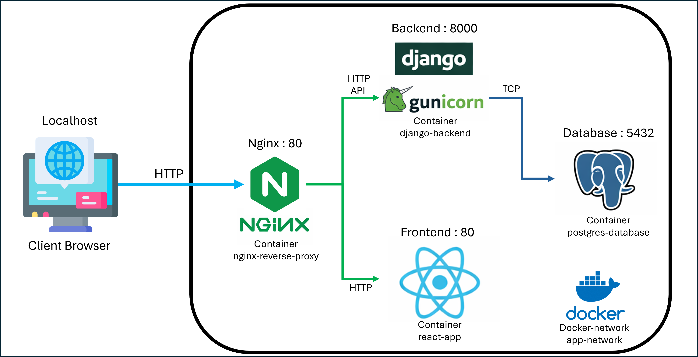

# Web Application Deployment

**React + Django + PostgreSQL + Nginx (Dockerized)**

A containerized full-stack web application stack built with **React**, **Django**, **PostgreSQL**, and **Nginx**, orchestrated using **Docker Compose**.

The goal of this project is to provide a **reproducible development environment** that allows developers to run the entire system locally with minimal setup.

---
# System Architecture


**Traffic Data Flow**
1. Client requests enter through **Nginx**
2. Nginx routes:
   * `/` → React frontend
   * `/api/` → Django backend
3. Django communicates with **PostgreSQL**

---

# Tech Stack
| Layer            | Technology        |
| ---------------- | ----------------- |
| Frontend         | React             |
| Backend          | Django + Gunicorn |
| Database         | PostgreSQL        |
| Reverse Proxy    | Nginx             |
| Containerization | Docker            |
| Orchestration    | Docker Compose    |


---

# Project Structure
```
project-root
│
├── docker-compose.yml
├── .env
│
├── react-app/
│   ├── Dockerfile
│   ├── package.json
│   └── src/
│
├── django/
│   ├── Dockerfile
│   ├── requirements.txt
│   ├── manage.py
│   |── django_backend/
│   └── api/
│
├── postgres/
│   ├── Dockerfile
│   └── init.sql
│
└── nginx/
    └── nginx.conf
```

---

# Prerequisites

Ensure the following tools are installed:

| Tool           | Version |
| -------------- | ------- |
| Docker         | ≥ 20.x  |
| Docker Compose | ≥ 2.x   |
| Git            | Latest  |

For Windows , Download Docker Desktop : https://www.docker.com/products/docker-desktop/

Verify installation:

```bash
docker --version
docker compose version
git --version
```

---

# Quick Start

Clone the repository.

```bash
git clone https://github.com/paokao1200/exam-test.git
cd exam-test
```

Create environment variables.

```bash
cp .env.example .env
```

Start all services.

```bash
docker compose up -d --build
```

Once containers start successfully, open:

```
http://localhost or http://server_ip
```

---

# Environment Configuration

Example `.env`

```
POSTGRES_DB=mydb
POSTGRES_USER=admin
POSTGRES_PASSWORD=admin123
POSTGRES_HOST=postgres
POSTGRES_PORT=5432
```

These values are used by:

* Docker Compose
* Django database configuration

---

# Running Services

After startup, the following containers will run:

| Service  | Description               |
| -------- | ------------------------- |
| nginx    | Reverse proxy entry point |
| frontend | React application         |
| backend  | Django API (Gunicorn)     |
| postgres | PostgreSQL database       |

Check container status:

```bash
docker ps
```

---

# Application Access

| Service  | URL                    |
| -------- | ---------------------- |
| Frontend | http://localhost       |
| API      | http://localhost/api   |

Note: Can be used Postman for test api.
---

# Django Management Commands

Run Django commands inside the backend container.

### Apply migrations

```bash
docker compose exec backend python manage.py migrate
```

### Create superuser

```bash
docker compose exec backend python manage.py createsuperuser
```

### Open Django shell

```bash
docker compose exec backend python manage.py shell
```

---

# Development Workflow

Build containers

```bash
docker compose build
```
Start containers

```bash
docker compose up -d
```

Stop containers

```bash
docker compose down
```

View logs

```bash
docker compose logs -f
```

Restart services

```bash
docker compose restart
```

---

# Database Access (Optional)

You can connect using database tools such as:

* pgAdmin
* DBeaver
* DataGrip

Example connection:

```
Host: localhost
Port: 5432
User: admin
Password: admin123
Database: mydb
```

Note: External access may require enabling the `ports` section in `docker-compose.yml`.

---

# Networking

Docker Compose creates an internal network.

Service hostname resolution:

```
frontend
backend
postgres
nginx
```

Example Django database host:

```
postgres
```

---

# Troubleshooting

### Containers fail to start

Check logs:

```bash
docker compose logs
```

---

### Port conflict

Check running containers:

```bash
docker ps
```

Stop conflicting services.

---

### Rebuild everything

```bash
docker compose down
docker compose up -d --build
```

---

# Production Notes

For production deployment consider:

* Enabling **HTTPS (TLS)**
* Using **environment secrets**
* Configuring **Gunicorn workers**
* Adding **Nginx caching**
* Using **CI/CD pipelines**

---

# License

This project is provided for development , examination and educational purposes.